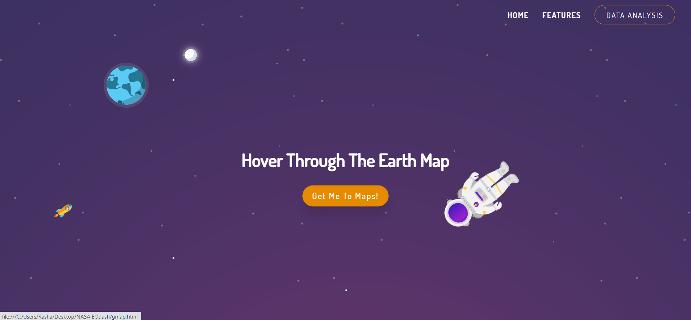
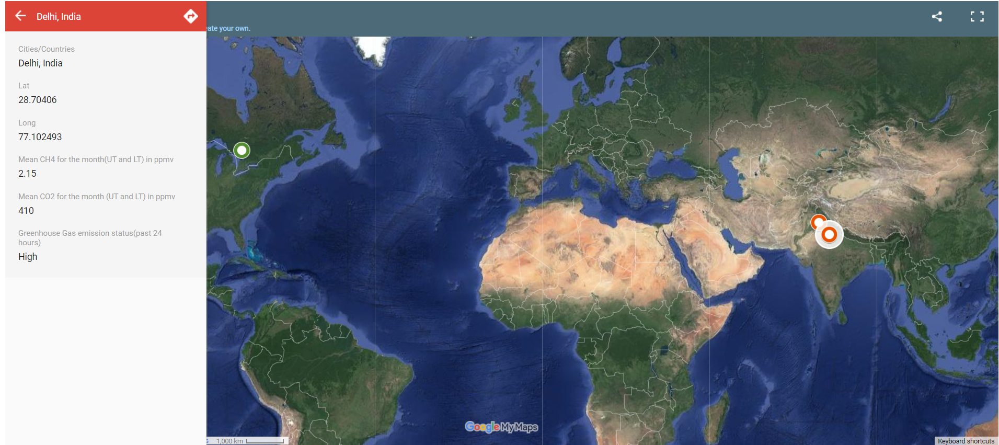
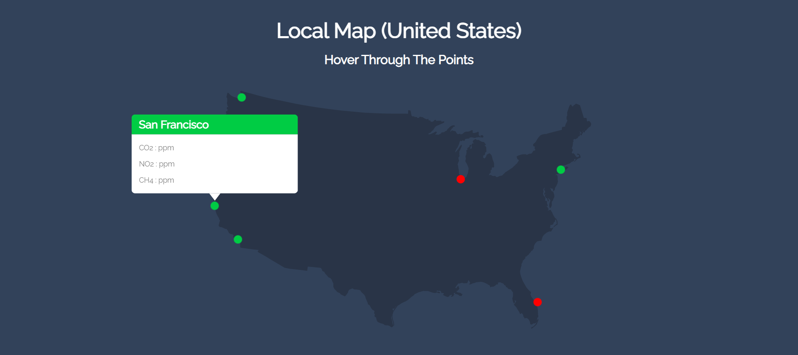

# Project Desciption

### Our task fosters a plotting apparatus that creates graphs for the CO2 and CH4 information for various areas all throughout the planet. It shows the varieties in the degree of ozone harming substance and how they impact the enivronment. The current highlights of the instrument includes the availability of indicators for the global map which shows districts that are under the danger of a dangerous atmospheric devation, capacity to drift through focuses on the guide, capacity to create charts that show local data of CO2 and CH4, and capacity to download the CSV documents of CO2 and CH4.

# Model Description

### This source code will give you an overview of what our project is.

## Our code is divided into four sections :

### • Home page : Initially the home page is displayed which contains the choice to be diverted to our first and primary part of the code which shows the worldwide map with pointer levels and information. 

### • Global Maps : The Global map gives a visualization of the green house gas emission rate in different regions. Red Indicators convey that the region has high mean rate and would be under threat if the same rate continues in the coming days. Green Indicators convey that the region has fair mean rate of greenhouse emission and the current level(in the past 24 hours) hasn't crossed the threshold limit. Moreover, by hovering through any region the user would be able to access additional data such as the mean rate of greenhouse gas emission (CO2 and CH4) in the past 30 days and also the status of greenhouse gas emssion rate in the past 24 hours(if the emission level passes beyond the threshold limit it would notify a red alert for the place). 

### • Features : The feature option on the top right corner of the home page will redirect you to a HTML file which will give you a visualization of our project in the coming future. We would possibly integrate the data of NO2 with CH4 and CO2 in order to make our product more feasible and simple.

### • Data Analysis : On the Top right corner of the home page, the data analysis sector contains the documentation of our case studies(in pdf format). We have integrated the datasets of the emission levels for CO2 and CH4 for both layers of troposphere in the same graph.

### <i>You can also access the data analysis documentation from the below link</i>

<a href = "https://github.com/rashafathima/eodash_hackathon/blob/main/Documentation/data%20analysis%20documentation.pdf">Data Analysis</a>

# Current Features

### • The data of both layers of troposphere and priori of the column averaged dry air mole fraction of greenhouse gases over a certain period are all plotted on the same graph represented by lines of varying color 
### • Availability of red indicators on the global map which shows the regions under threat / the regions that contribute the most to global warming 
### • Ability to hover through the points on map and hence display the ppm level of greenhouse gases and status of that region in the past 24 hours  
### • Ability to download the CSV files of the greenhouse gases(CO2 and CH4) for both layers of troposphere for a particular region

# Future Scope

### • Tool to draw a polygon/square over a certain region in map and determine its mean greenhouse gas(CO2 and CH4 ; possibly NO2 too ) emmission rate in the past 24 hours and display the current status of the region 
### • A comparison graph to compare the greenhouse emission rate for any given years( the user has an option to select the years and compare between them ) 
### • An option to display the future vision of a particular place(or the whole globe) by performing mathematical analysis over the data of past 5 years from that region.
### • An option to change/select the dates and hence display the statistics during the selected time period.
